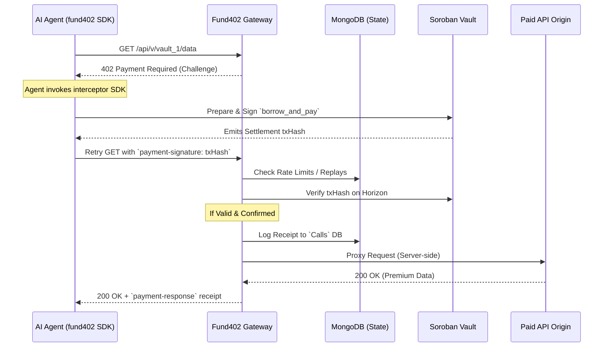

# Fund402 Gateway & Soroban Vault

Fund402 is an autonomous protocol for AI commerce. It bridges the gap between machine-to-machine payments and AI agents by providing **Just-In-Time (JIT) Flash Loans** on the Stellar Network using Soroban. 

When an AI agent hits a paywall (HTTP 402 Payment Required), the Fund402 Gateway issues an L402-compliant challenge. If the agent lacks funds, the Gateway facilitates an instant USDC JIT loan from the Fund402 Soroban Vault, enabling the agent to pay the paywall, access the data, and resolve the loan—all in a single on-chain transaction.

## 🚀 Architecture Flow



## 📁 Repository Structure

*   **/contracts/fund402_vault/**: The core Soroban smart contract for the liquidity pool and JIT loans.
*   **/src/app/api/v/[vault_id]/**: The Next.js API Gateway that intercepts, challenges, and proxies HTTP requests based on Stellar network payments.
*   **/packages/agent-sdk/**: The universal Axios interceptor SDK used by AI agents to automatically negotiate 402 challenges.

## 🛠 Setup & Running

**Prerequisites:** Node.js, MongoDB cluster (for state/rate limits), and the Stellar CLI.

1.  **Install Dependencies:**
    ```bash
    npm install
    # Wait for the postinstall script to build the local agent-sdk
    ```

2.  **Configure Environment:**
    Ensure your `.env.local` is set with your Testnet Horizon, Soroban RPC, MongoDB, and the Vault Contract ID:
    ```
    STELLAR_NETWORK=testnet
    SOROBAN_RPC_URL=https://soroban-testnet.stellar.org
    HORIZON_URL=https://horizon-testnet.stellar.org
    MONGODB_URI=mongodb+srv://...
    FUND402_VAULT_CONTRACT_ID=<YOUR_DEPLOYED_CONTRACT_ID>
    USDC_ISSUER=GBBD47IF6LWK7P7MDEVSCWR7DPUWV3NY3DTQEVFL4NAT4AQH3ZLLFLA5
    ```

3.  **Run the Gateway:**
    ```bash
    npm run dev
    # Runs on localhost:3005
    ```

The Gateway uses MongoDB to configure the origins and merchant addresses for active vaults and to track all confirmed 402 payments.
